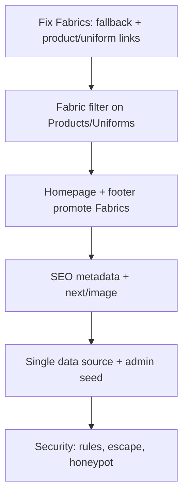

# Force Sports Website — Faults, Gaps & Solutions

Audit of the **Force Sports & Wears India** Next.js site (`forcesportswearsindia-`).  
Last updated: May 2026.

---

## What’s working well

- **Clear B2B focus** — Products, uniforms, catalog, inquiry, and WhatsApp suit teamwear and bulk orders.
- **Strong visual design** — Consistent branding, motion, and professional product cards.
- **Admin (`/force-hq`)** — Firebase-backed products, uniforms, fabrics, and leads for updates without redeploying.
- **Lead capture** — Inquiry page, inline lead form, Firebase storage, and Resend email notifications.
- **Product detail** — Front/back images, zoom, size charts, Sportex fabric badge on detail pages.
- **Basic SEO** — Schema.org (Organization + local business), `sitemap.xml`, Vercel Analytics.
- **Smoke tests** — Playwright covers home, products, inquiry, and product detail.

---

## Critical faults (fix first)

| # | Fault | Why it matters | Solution |
|---|--------|----------------|----------|
| 1 | **Fabrics page depends only on Firebase** | Empty or failed Firebase → blank `/fabrics`. Local swatches unused. | In `FabricsPage.tsx`: load Firestore first; if empty or error, use `SPORTEX_FABRICS` from `sportexFabrics.ts` with images `/Sportex Fabrics/{file}`. Show a small “Live from admin” badge when Firebase has data. |
| 2 | **Product ↔ fabric links missing on Fabrics page** | Buyers can’t see which kits use each fabric. | Call `getFabricsWithLinks()` from `fabricMatching.ts` and render **Products** / **Uniforms** links on each fabric card (max 3 + “+N more”). Keep detail-page badges as-is. |
| 3 | **Two sources of truth** | List and detail pages can disagree (title, image, ID). | **Pick one primary source:** (A) Firestore for all public catalog + seed script from TS files, or (B) static TS only + admin for leads. Merge rule: `const item = firestoreDoc ?? localFallback`. Document in README. |
| 4 | **“Customize” uses `alert()` only** | No real lead; looks unfinished. | Replace `alert()` with: `router.push(\`/inquiry?product=${encodeURIComponent(title)}&fabric=${sportexFabric}\`)` or `addDoc` to `inquiries` + toast “Request sent”. Pass product code and fabric in the message body. |
| 5 | **SEO is client-only** | Weak Google/social previews. | Add `export const metadata` in each `src/app/**/page.tsx` (title, description, openGraph). Keep `SEO.tsx` only for dynamic product titles or remove it gradually. |

---

## Technical & maintenance gaps

| # | Gap | Location / notes | Solution |
|---|-----|------------------|----------|
| 6 | **Very large `products.ts`** | ~4000+ lines; heavy client bundle. | Split into `products/cricket.ts`, `products/caps.ts`, etc., and re-export; or move catalog to Firestore + API route `GET /api/products`; or dynamic `import()` per category on Products page. |
| 7 | **No `next/image`** | No auto optimization. | Replace `` with `<Image src={...} width={} height={} alt={} />` on product, uniform, fabric, and hero images. Use `fill` + `sizes` for cards. Allow remote patterns for Firebase Storage and jsDelivr in `next.config`. |
| 8 | **Outdated README** | Says “Vite”; project is Next.js. | Rewrite `README.md`: install (`npm i`), env vars, `npm run dev` / `build` / `start`, folder structure, `/force-hq` admin, deploy (Vercel). |
| 9 | **Wrong env example** | `VITE_*` vs `NEXT_PUBLIC_*`. | Update `.env.example` with: `NEXT_PUBLIC_FIREBASE_*`, `RESEND_API_KEY`, `NEXT_PUBLIC_SITE_URL`, optional `NEXT_PUBLIC_API_BASE_URL`. Add short comments per variable. |
| 10 | **CDN helper mixed with Vite** | `import.meta` in Next. | Refactor `cdnUtils.ts` to use `process.env.NODE_ENV === 'development'` and `process.env.NEXT_PUBLIC_SITE_URL` only. Or always use `/path` from `public/` in production. |
| 11 | **Firebase config in source** | Keys committed to git. | Move config to `NEXT_PUBLIC_FIREBASE_*` in `.env.local`. Read via `process.env` in `firebase.ts`. Add `.env.local` to `.gitignore` (if not already). |
| 12 | **Resend sender limit** | `onboarding@resend.dev` test mode. | Verify domain `forcesportsindia.com` in Resend; set `from: 'Force Sports <leads@forcesportsindia.com>'`. Use `BRAND_DETAILS.contacts.inquiryEmail` as `to`. |
| 13 | **Incomplete sitemap** | Missing `/faq`; possible 404 product URLs. | Add `<url>` for `/faq` and `/fabrics`. Generate product/uniform URLs from `PRODUCTS` / `UNIFORMS` ids via a script `npm run sitemap` (Node script writes `public/sitemap.xml`). |
| 14 | **Minimal automated tests** | Only basic smoke tests. | Add Playwright tests: `/fabrics` loads with ≥1 fabric; fabric card has product link; inquiry `?product=` prefills; optional admin login smoke behind env flag. |

---

## UX & content gaps

| # | Gap | Detail | Solution |
|---|-----|--------|----------|
| 15 | **Homepage doesn’t promote Fabrics** | Nav only entry point. | Add section after hero: “Sportex Fabric Library — 23+ materials with GSM” + CTA to `/fabrics` + 3 featured fabric swatches. |
| 16 | **No fabric filter on Products / Uniforms** | Can’t shop by material. | Add filter chip/dropdown “Sportex fabric” populated from `SPORTEX_FABRICS`. Filter using `getProductSportexFabric()` / `getUniformSportexFabric()` per item. |
| 17 | **Footer missing Uniforms** | Incomplete navigation. | Add link: `Uniforms` → `/uniforms` in Footer quick navigation (match Navbar). |
| 18 | **404 page limited links** | Dead-end for some users. | Add buttons: **Fabrics** (`/fabrics`), **Uniforms** (`/uniforms`), **Inquiry** (`/inquiry`) beside Home and Products. |
| 19 | **Fragile image paths** | Spaces in folder names. | Rename folders to `sportex-fabrics` and `new-folder` (or encode in a single `getAssetUrl()` helper). Update admin upload paths and `sportexFabrics.ts` `file` fields. |
| 20 | **Manufacturing removed from nav** | About still says “manufacturing”. | Update About copy: link “Browse fabrics & GSM” → `/fabrics` instead of old manufacturing CTA. Keep `/manufacturing` redirect. |

---

## Security & operations gaps

| # | Gap | Detail | Solution |
|---|-----|--------|----------|
| 21 | **No API rate limiting** | Spam risk on `/api/contact`. | Use Vercel KV or in-memory limit (e.g. 5 POST/hour per IP). Return `429` when exceeded. Alternatively use Resend + Firebase only from authenticated forms with honeypot. |
| 22 | **No form honeypot / CAPTCHA** | Bot submissions. | Add hidden field `website` (must stay empty). Optional: Cloudflare Turnstile on inquiry + lead form. |
| 23 | **Firestore rules not in repo** | Security not reviewable. | Add `firestore.rules` to repo: public **read** on `products`, `uniforms`, `fabrics`; **write** only `inquiries` (create); admin collections **deny** unless `request.auth != null`. Deploy with Firebase CLI. |
| 24 | **Contact email HTML injection** | XSS in email body. | Escape HTML in `route.ts` (`escapeHtml(str)` for all user fields) or use Resend React Email templates with sanitized props. |

---

## Sportex / Fabrics feature status

| Feature | Intended | Current status | Solution to complete |
|---------|----------|----------------|----------------------|
| Sportex catalog + GSM | PDF + swatches | Firebase only on `/fabrics` | Fallback + seed Firestore from `sportexFabrics.ts` via admin “Import defaults” button |
| Navbar “Fabrics” | `/fabrics` | ✅ Working | — |
| Manufacturing redirect | → `/fabrics` | ✅ Working | — |
| Match products to fabrics | `fabricMatching.ts` | Detail only | Restore links on `FabricsPage` via `getFabricsWithLinks()` |
| Match uniforms to fabrics | `fabricMatching.ts` | Detail only | Same as above |
| GSM on fabric cards | Per swatch | ✅ if Firebase has `gsm` | Seed `gsm` from `sportexFabrics.ts` in admin import |

**Target architecture:** One fabric list (local fallback + Firebase override) → matching engine → products / uniforms / inquiry / WhatsApp all use the same `sportexFabric` name.

---

## Implementation guide (step-by-step)

### Phase 1 — Fabrics & catalog (1–2 days)

1. Update `FabricsPage.tsx`:
   - `onSnapshot` fabrics collection.
   - If `data.length === 0`, set state from `getFabricsWithLinks()` merged with local images.
   - Render product/uniform links under each card.
2. Add `sportexFabric?: string` field on Firestore product/uniform docs (optional); fallback to `fabricMatching` if missing.
3. Products page: fabric filter state + filter function using `getProductSportexFabric`.
4. Customize button → `/inquiry?product=...&fabric=...`.

### Phase 2 — SEO & docs (1 day)

5. Add `metadata` to `src/app/page.tsx`, `products/page.tsx`, `fabrics/page.tsx`, `uniforms/page.tsx`, `about/page.tsx`, `faq/page.tsx`, `inquiry/page.tsx`.
6. Update `README.md` and `.env.example`.
7. Extend `sitemap.xml` with `/faq`; script to regenerate product URLs.

### Phase 3 — Quality & security (3–5 days)

8. `escapeHtml` in contact API; honeypot on forms.
9. Export `firestore.rules` to repo and deploy.
10. Move Firebase config to env vars.
11. Start replacing hero/product images with `next/image`.

### Phase 4 — Growth (ongoing)

12. Homepage fabrics section + footer Uniforms link.
13. Product JSON-LD on detail pages.
14. Blog posts: “Dryfit vs Honeycomb”, “School uniform GSM guide” → internal links to `/fabrics`.
15. WhatsApp helper: `buildWhatsAppUrl({ product, fabric, gsm })`.

---

## Code snippets (reference solutions)

### Fabrics fallback (concept)

```tsx
// After Firebase snapshot:
const linked = getFabricsWithLinks();
const display = firebaseFabrics.length > 0
  ? mergeFirebaseWithLinks(firebaseFabrics, linked)
  : linked;
```

### Customize → inquiry (concept)

```tsx
const fabric = getProductSportexFabric(product.id, ...);
router.push(`/inquiry?product=${encodeURIComponent(product.title)}&fabric=${encodeURIComponent(fabric)}`);
```

### Per-route SEO (concept)

```tsx
// src/app/fabrics/page.tsx
export const metadata = {
  title: 'Sportex Fabric Library | GSM Catalog',
  description: 'Browse 23+ Sportex technical fabrics with GSM for custom sportswear.',
  openGraph: { url: 'https://www.forcesportsindia.com/fabrics' },
};
```

### HTML escape in contact API (concept)

```ts
function escapeHtml(s: string) {
  return s.replace(/&/g, '&amp;').replace(/</g, '&lt;').replace(/>/g, '&gt;').replace(/"/g, '&quot;');
}
// Use escapeHtml(fullName), escapeHtml(message), etc. in htmlContent
```

### Firestore rules (starter)

```
rules_version = '2';
service cloud.firestore {
  match /databases/{database}/documents {
    match /products/{id} { allow read: if true; allow write: if request.auth != null; }
    match /uniforms/{id} { allow read: if true; allow write: if request.auth != null; }
    match /fabrics/{id} { allow read: if true; allow write: if request.auth != null; }
    match /inquiries/{id} { allow create: if true; allow read, update, delete: if request.auth != null; }
  }
}
```

---

## Priority roadmap



| Priority | Task | Effort | Impact |
|----------|------|--------|--------|
| P0 | Fabrics fallback + linked products/uniforms | 4–6 h | High |
| P0 | Customize → inquiry with fabric | 1–2 h | High |
| P1 | Fabric filter on Products/Uniforms | 3–4 h | High |
| P1 | Route `metadata` for SEO | 2–3 h | Medium |
| P1 | README + `.env.example` | 1 h | Medium |
| P2 | `next/image` on catalog cards | 4–8 h | Medium |
| P2 | Firestore rules + env-based Firebase | 2–4 h | High (security) |
| P2 | Contact API escape + honeypot | 1–2 h | Medium |
| P3 | Sitemap generator script | 2 h | Low |
| P3 | Homepage fabrics section | 2–3 h | Medium |

---

## Related files

| Area | Path |
|------|------|
| Fabrics page | `src/views/Fabrics/FabricsPage.tsx` |
| Fabric data | `src/data/sportexFabrics.ts` |
| Fabric matching | `src/utils/fabricMatching.ts` |
| Products data | `src/data/products.ts` |
| Uniforms data | `src/data/uniforms.ts` |
| SEO (client) | `src/components/seo/SEO.tsx` |
| Schema | `src/components/seo/Schema.tsx` |
| Contact API | `src/app/api/contact/route.ts` |
| Admin | `src/app/force-hq/` |
| Sitemap | `public/sitemap.xml` |
| Swatches | `public/Sportex Fabrics/` |
| Catalog PDF | `public/Sportex India (1).pdf` |

---

## Summary

| Category | Count | Top action |
|----------|-------|------------|
| Critical faults | 5 | Fabrics fallback + links + inquiry from Customize |
| Technical gaps | 9 | SEO metadata, env/README, smaller bundle |
| UX gaps | 6 | Homepage fabrics, filters, footer |
| Security gaps | 4 | Firestore rules, escape HTML, honeypot |

The site is **visually strong** and close to a production B2B catalog. Applying the **P0 solutions** connects Sportex GSM to products, uniforms, and leads end-to-end — your main differentiator vs generic apparel sites.
